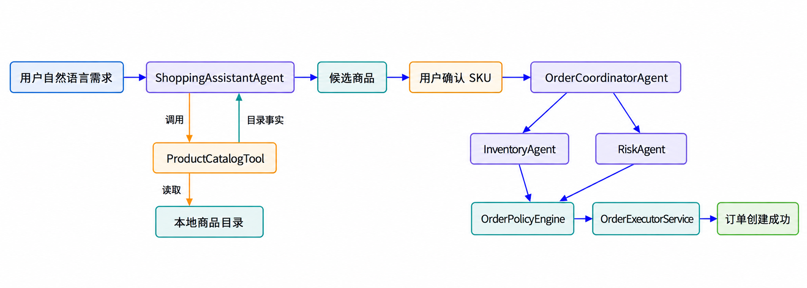
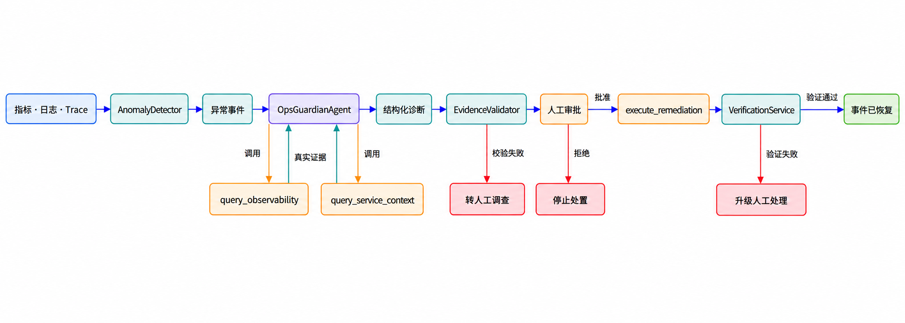

# Multi-Agent Order & Ops System

一个可运行、可观测、可审批、可恢复的多智能体订单演示系统。项目以“自然语言购物 + 多 Agent 订单处理”为业务主线，并提供独立的运维助手，用于异常检测、证据驱动诊断、人工审批、模拟回滚和恢复验证。

本项目面向课程实验与多智能体系统展示，不连接真实商城、支付平台或生产基础设施。

## 项目要点

- **自然语言购物**：理解预算、用途和偏好，主动读取本地商品目录并推荐真实 SKU。
- **多 Agent 协作**：购物助手、订单协调、库存检查和风险检查 Agent 分工协作。
- **事实与推理解耦**：模型负责理解、选择和解释；价格、库存、商品属性和订单状态由确定性代码校验。
- **显式用户确认**：候选商品不会自动下单，只有用户确认 SKU 后才进入订单流程。
- **全链路可观测**：记录指标、结构化日志、Trace、Agent/Prompt/模型/工具版本。
- **证据驱动运维**：诊断结果必须引用真实存在的证据，缺失或伪造引用会被拒绝。
- **人工审批安全门**：回滚和订单重放等危险动作没有有效审批令牌时无法执行。
- **恢复闭环**：支持故障注入、异常检测、诊断、审批、模拟回滚、验证和安全重放。
- **模型可替换**：默认使用可重复的 Mock Provider，也可切换到 Ollama/Qwen 或其他 OpenAI 兼容服务。

## 系统流程

### 自然语言购物与订单处理



1. `ShoppingAssistantAgent` 分析用户需求，并调用只读 `ProductCatalogTool` 获取目录事实。
2. Agent 选择并解释候选商品；系统用目录数据重新填充并校验 SKU、名称、价格、库存和属性。
3. 用户显式确认候选 SKU，服务端重新读取价格并构造订单请求。
4. `OrderCoordinatorAgent` 调度 `InventoryAgent` 和 `RiskAgent`。
5. `OrderPolicyEngine` 做确定性决策，`OrderExecutorService` 幂等创建订单并扣减库存。

### 运维助手与故障恢复



1. `AnomalyDetector` 根据指标、日志和 Trace 生成异常事件。
2. `OpsGuardianAgent` 调用只读工具收集观测证据和服务上下文。
3. `EvidenceValidator` 校验诊断引用，防止无依据的高置信度结论。
4. 高风险处置必须经人工审批；无审批会返回 `HUMAN_APPROVAL_REQUIRED`。
5. 模拟回滚后由 `VerificationService` 重新探测，验证通过才将事件标记为已恢复。

## Agent 与工具

| 组件 | 类型 | 主要职责 |
| --- | --- | --- |
| `ShoppingAssistantAgent` | 业务 Agent | 分析自然语言需求、调用目录工具、选择候选并说明取舍 |
| `OrderCoordinatorAgent` | 业务 Agent | 校验订单请求，协调库存和风险检查 |
| `InventoryAgent` | 业务 Agent | 查询库存并返回结构化判断 |
| `RiskAgent` | 业务 Agent | 查询用户风险事实并返回风险判断 |
| `OpsGuardianAgent` | 运维 Agent | 调查异常、关联证据、生成根因候选和建议动作 |
| `ProductCatalogTool` | 只读业务工具 | 返回版本化商品目录，不负责语义匹配或评分 |
| `query_observability` | 只读运维工具 | 查询指标、日志和调用链 |
| `query_service_context` | 只读运维工具 | 查询发布、配置、依赖、负责人和运行手册 |
| `execute_remediation` | 高风险运维工具 | 在权限和审批校验通过后执行模拟回滚等动作 |

每条诊断证据固定包含五个顶层字段：`evidence_id`、`time`、`source`、`object` 和 `fact`。证据编号由平台生成，模型只能引用，不能自行创建。

## 技术栈

- Python 3.11+
- FastAPI、Pydantic、httpx
- SQLite、JSON/YAML
- pytest
- Ollama/OpenAI 兼容 Chat Completions API（可选）

## 快速开始

以下命令以 Windows PowerShell 为例。

### 1. 获取项目并安装依赖

```powershell
git clone https://github.com/Luikayu/Multi-Agent-Order-Ops-System.git
cd Multi-Agent-Order-Ops-System

py -3.11 -m venv .venv
Set-ExecutionPolicy -Scope Process Bypass
.\.venv\Scripts\Activate.ps1
python -m pip install --upgrade pip
python -m pip install -e ".[dev]"
```

如果已经安装 [uv](https://docs.astral.sh/uv/)，也可以使用锁定依赖：

```powershell
uv sync --extra dev
```

### 2. 运行测试

```powershell
.\.venv\Scripts\python.exe -m pytest -q
```

最近一次完整回归结果（2026-10-01）：`203 passed, 2 skipped, 1 warning`。其中 warning 是 FastAPI TestClient/httpx 的弃用提示，不影响项目功能。

### 3. 启动默认 Mock 服务

Mock 模式不需要 API Key，也不需要本地大模型，适合首次运行和稳定复现实验。

```powershell
$env:MODEL_PROVIDER = "mock"
.\.venv\Scripts\python.exe -m uvicorn order_agent_ops.main:app --host 127.0.0.1 --port 8000
```

启动后可访问：

- 运维演示页面：<http://127.0.0.1:8000/ops/ui>
- OpenAPI 文档：<http://127.0.0.1:8000/docs>
- 健康检查：<http://127.0.0.1:8000/health>

如果 `8000` 端口已被占用，请先停止旧进程，或把命令中的端口改为 `8001`，并同步修改后续 `--base-url`。

## 推荐演示流程

### 演示一：自然语言购物完整流程

#### 方式 A：一条命令稳定演示（Mock）

不需要先启动 Uvicorn。脚本会创建隔离的进程内应用，完成需求分析、目录读取、候选确认和订单创建：

```powershell
.\.venv\Scripts\python.exe scripts\run_shopping_workflow.py `
  --message "我想买一个1000元以内、适合晚上在宿舍写代码的无线机械键盘" `
  --output-format pretty
```

终端会依次展示：

- 用户原始需求与结构化意图；
- `ready_to_search`、候选 SKU、商品名称、价格和推荐理由；
- 用户确认结果与服务端重新读取的价格；
- 订单 ID、最终状态、Trace ID 和 Agent 执行顺序。

#### 方式 B：调用已经启动的 API

先按“启动默认 Mock 服务”运行 Uvicorn，再在新终端执行：

```powershell
$idempotencyKey = "shopping-$([guid]::NewGuid().ToString('N'))"

.\.venv\Scripts\python.exe scripts\run_shopping_workflow.py `
  --base-url http://127.0.0.1:8000 `
  --message "我想买一个1000元以内、适合晚上在宿舍写代码的无线机械键盘" `
  --idempotency-key $idempotencyKey `
  --request-timeout 180 `
  --output-format pretty
```

每次运行都应使用新的幂等键。相同幂等键只能用于完全相同的订单输入，否则系统会返回 `PURCHASE_CONFIRMATION_CONFLICT`。

### 演示二：库存延迟故障与运维闭环

该脚本固定使用隔离的 Mock 应用，不依赖正在运行的 Uvicorn，也不会修改真实系统服务：

```powershell
.\.venv\Scripts\python.exe scripts\run_inventory_latency_incident.py `
  --database .\artifacts\inventory_demo.sqlite3 `
  --artifacts .\artifacts
```

脚本会自动完成：

1. 启用 `inventory_v21_latency`，将库存查询延迟设置为约 2300 ms；
2. 创建测试订单并触发 `inventory_p95_latency` 异常事件；
3. 收集指标、日志、Trace、发布记录和对象上下文证据；
4. 生成带置信度和证据引用的根因候选；
5. 演示未审批回滚被拒绝；
6. 创建并批准人工审批；
7. 将模拟版本从 `v2.1` 回滚到 `v2.0`；
8. 重新探测指标，验证恢复并安全重放 pending 订单。

主要输出文件：

```text
artifacts/reports/inventory_latency_incident_report.json
artifacts/traces/inventory_latency_incident_traces.json
```

这两个文件包含完整的异常、证据、诊断、审批、动作、验证和重放结果，可直接用于课堂展示或实验报告取证。

## 使用 Ollama/Qwen 运行

项目不在 Agent 内硬编码模型厂商。Qwen 通过 Ollama 的 OpenAI 兼容接口接入，Python 负责工具调度。

确认 Ollama 已安装并已下载模型后，在 PowerShell 中配置并启动服务：

```powershell
$env:MODEL_PROVIDER = "openai_compatible"
$env:MODEL_BASE_URL = "http://localhost:11434/v1"
$env:MODEL_API_KEY_ENV = ""
$env:MODEL_NAME = "qwen3:1.7b"
$env:MODEL_TIMEOUT_SECONDS = "180"

.\.venv\Scripts\python.exe -m uvicorn order_agent_ops.main:app --host 127.0.0.1 --port 8000
```

在另一个 PowerShell 终端运行购物流程：

```powershell
$idempotencyKey = "qwen-$([guid]::NewGuid().ToString('N'))"

.\.venv\Scripts\python.exe scripts\run_shopping_workflow.py `
  --base-url http://127.0.0.1:8000 `
  --message "我想买一个1000元以内、适合晚上在宿舍写代码的无线机械键盘" `
  --idempotency-key $idempotencyKey `
  --request-timeout 240 `
  --output-format pretty
```

环境变量只对新启动的进程生效。修改代码或模型配置后，需要停止并重新启动 Uvicorn。

### 可选：真实 Ollama 集成测试

```powershell
$env:RUN_OLLAMA_E2E_TESTS = "1"
$env:OLLAMA_TEST_BASE_URL = "http://localhost:11434/v1"
$env:OLLAMA_TEST_MODEL = "qwen3:1.7b"
$env:OLLAMA_TEST_TIMEOUT_SECONDS = "180"

.\.venv\Scripts\python.exe -m pytest `
  tests\integration\test_openai_compatible_provider.py `
  -k ollama -vv -s
```

## 输出与重置

自然语言购物每次运行都会生成新的编号，不覆盖已有结果：

```text
artifacts/reports/shopping_workflow_report_001.json
artifacts/traces/shopping_workflow_trace_001.json
```

后续运行会自动使用 `002`、`003` 等编号。运行产物和 SQLite 数据库默认被 Git 忽略。

只重置演示数据库：

```powershell
.\.venv\Scripts\python.exe scripts\reset_demo.py
```

同时清理已知的演示 JSON 产物：

```powershell
.\.venv\Scripts\python.exe scripts\reset_demo.py --clear-artifacts
```

## API 概览

### 自然语言选购

- `POST /shopping/intents`：创建选购意图并返回澄清问题或候选商品。
- `GET /shopping/intents/{intent_id}`：查询意图、结构化需求和候选。
- `POST /shopping/intents/{intent_id}/messages`：补充澄清信息。
- `POST /shopping/intents/{intent_id}/confirm`：确认候选 SKU 并进入订单流程。

### 订单处理

- `POST /orders`：提交结构化订单请求。
- `GET /orders/{order_id}`：查询订单状态。
- `POST /orders/{order_id}/replay`：经独立审批后重放 pending 订单。

### 运维与恢复

- `GET /ops/incidents`：列出异常事件。
- `POST /ops/detect`：运行确定性异常检测。
- `POST /ops/incidents/{incident_id}/diagnose`：触发证据驱动诊断。
- `GET /ops/evidence`：查询证据记录。
- `POST /ops/approvals`：创建审批请求。
- `POST /ops/approvals/{approval_id}/decision`：批准或拒绝。
- `POST /ops/actions`：执行经审批的处置动作。
- `POST /ops/incidents/{incident_id}/verify`：执行恢复验证。
- `GET /ops/traces/{trace_id}`：查询完整调用链。

完整请求与响应结构请查看启动后的 Swagger 页面：<http://127.0.0.1:8000/docs>。

## 安全边界

- 模型可以理解需求、选择目录中的 SKU 并生成解释，但不能创建可信商品事实。
- SKU 必须存在于本次目录快照中；类别、预算、启用状态和库存数量由代码强制校验。
- 机械/薄膜、无线/有线、噪音、材质和布局等特征允许近似匹配，但必须说明取舍。
- 用户确认前不会创建订单或扣减库存；确认时价格由服务端重新读取。
- 库存与风险结果必须经过确定性策略引擎，Agent 不能直接写入最终订单状态。
- 运维诊断必须引用 Evidence Store 中真实存在的证据。
- 回滚和订单重放等危险动作必须通过权限与人工审批校验。
- 项目中的“回滚”只切换模拟版本和故障配置，不执行真实系统管理命令。

## 项目结构

```text
.
├── config/                  # 应用与故障场景配置
├── data/                    # 商品目录、用户、服务档案与发布记录
├── docs/images/             # README 流程图
├── scripts/                 # 正常流程、故障实验和重置脚本
├── src/order_agent_ops/
│   ├── agents/              # 业务 Agent 与运维 Agent
│   ├── api/                 # FastAPI 路由和演示页面
│   ├── business/            # 策略、订单执行和业务适配器
│   ├── domain/              # Pydantic 领域模型
│   ├── models/              # Model Gateway 与 Provider
│   ├── ops/                 # 检测、证据、审批、处置和验证
│   ├── services/            # 业务与事件工作流编排
│   ├── storage/             # SQLite 与 Repository
│   ├── telemetry/           # 指标、日志和 Trace
│   └── tools/               # 商品目录及三个运维工具
├── tests/                   # 单元、集成与场景测试
└── artifacts/               # 本地生成的报告与 Trace（默认忽略）
```

## 当前限制

- 商品目录在应用启动时加载，修改 `data/products.json` 后需要重启服务。
- 当前一次把 43 件商品的紧凑目录交给模型，适合课堂演示；大规模目录需要分页、检索或向量召回。
- 小参数模型的推荐理由可能较简单，系统会以本地目录事实校验或补全说明。
- 运维数据、发布、审批和回滚均为本地模拟，不代表生产级基础设施。
- 当前没有完整购物前端；主要通过 API、命令行脚本和最小运维页面演示。

## 项目定位

该仓库重点展示的是多智能体协作中的工程边界：让模型承担语义理解和推理，让工具提供可追溯事实，让确定性代码负责状态、安全、审批和恢复。它不是生产级电商系统，也不会执行真实支付、真实发布回滚或外部商城自动下单。
